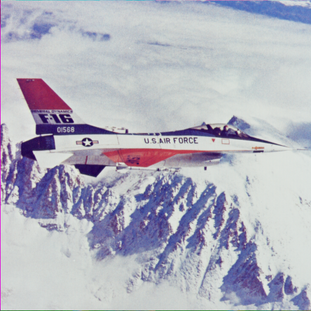

# Introduction

This is the implementation of the model in the paper `Self2Self With Dropout: Learning Self-Supervised Denoising From Single Image`. The original implementation is in `Tensorflow`, and this is the `Pytorch` version, only setting up for denoising task.

I also implement the DnCNN with similar self2self structure, and the performance is similar to the original model, which shows the robustness of the self2self structure and such self-supervised learning method.

```
@InProceedings{Quan_2020_CVPR,
author = {Quan, Yuhui and Chen, Mingqin and Pang, Tongyao and Ji, Hui},
title = {Self2Self With Dropout: Learning Self-Supervised Denoising From Single Image},
booktitle = {IEEE/CVF Conference on Computer Vision and Pattern Recognition (CVPR)},
month = {June},
year = {2020}
}
```
# Requirements

These are the requirements for the code to run:

* Python 3.8.18
* torch 2.2.2+cu121
* torchvision==0.17.2+cu121
* cv2 4.9.0(Opencv for python)

# Performance

This is the recovered image of the Unet based model on "F16" image from 25 noise level.

## Original Image



## Noisy Image


## Recovered Image


# How to execute

Run the code `multidevice_unet.py` for original model, run the code `dncnn.py` for DnCNN with similar self2self structure.
Both of them have similar performance on "Set9" denoising task.